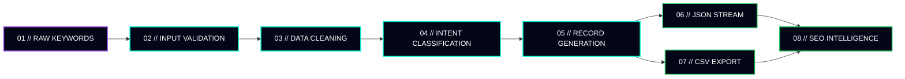

<!-- ======================================================= -->
<!--              ADVANCED SEO AUTOMATION ENGINE              -->
<!-- ======================================================= -->

<div align="center">


<br>


<br>


</div>

---

## `01 // ENGINE OVERVIEW`

```yaml
system:
  name: "Advanced SEO Automation Engine"
  environment: "Python 3.x"
  architecture: "Object-Oriented Processing Pipeline"
  status: "Operational"

mission:
  input: "Raw keyword and search visibility data"
  process:
    - Clean
    - Normalize
    - Classify
    - Validate
    - Export
  output: "Structured SEO intelligence"

primary_use_cases:
  - Keyword intent classification
  - Search opportunity discovery
  - Large-scale dataset processing
  - JSON schema generation
  - Automated CSV reporting
```

> A modular Python-based data intelligence engine designed to transform unstructured keyword data into clean, classified, and export-ready SEO datasets.

---

## `02 // CORE PROCESSING MODULES`

<table>
<tr>
<td width="50%" valign="top">

### ⚡ Intent Classification Engine

Uses an extensible text-matching matrix to categorize keywords according to their likely search intent.

**Supported classification logic**

- Informational intent
- Transactional intent
- Commercial investigation
- Navigational intent
- Content opportunity detection
- Custom classification rules

</td>
<td width="50%" valign="top">

### ◈ Data Normalization Layer

Cleans and standardizes raw input before it enters the main processing pipeline.

**Processing functions**

- Whitespace removal
- Character normalization
- Case standardization
- Empty-value validation
- Duplicate handling
- Keyword ID generation

</td>
</tr>

<tr>
<td width="50%" valign="top">

### ⬡ Structured Data Generator

Converts processed keyword records into predictable, production-ready data objects.

**Generated properties**

- Unique keyword ID
- Original keyword value
- Intent classification
- Processing timestamp
- Validation status
- Structured JSON output

</td>
<td width="50%" valign="top">

### ⌁ CSV Export Engine

Creates localized spreadsheet-ready files after successful pipeline validation.

**Export capabilities**

- Automated file creation
- Dynamic column generation
- UTF-8 encoding
- Safe directory handling
- Error logging
- Export completion confirmation

</td>
</tr>
</table>

---

## `03 // PROCESSING PIPELINE`



<div align="center">

`INGEST` → `NORMALIZE` → `CLASSIFY` → `VALIDATE` → `EXPORT`

</div>

---

## `04 // ARCHITECTURAL STACK`

### Runtime environment

<p>
  
  
  
</p>

### Core modules

<p>
  
  
  
  
  
</p>

### Engine principles

| Directive | Purpose |
|---|---|
| `MODULAR` | Keep processing components isolated and reusable |
| `EXTENSIBLE` | Allow new intent rules and classifiers to be added |
| `FAULT-TOLERANT` | Prevent failed exports from terminating silently |
| `TRACEABLE` | Record execution events through structured logging |
| `SCALABLE` | Support increasing keyword volumes without redesign |

---

## `05 // DATA OBJECT SCHEMA`

Each processed keyword is converted into a structured record:

```json
{
  "id": "KW-0001",
  "keyword": "how to optimize for ai overviews",
  "intent_classification": "Informational (Content Opportunity)",
  "processed_at": "2026-06-17 13:28:00",
  "status": "Verified"
}
```

### Schema reference

| Property | Type | Description |
|---|---|---|
| `id` | String | Automatically generated keyword identifier |
| `keyword` | String | Cleaned search query |
| `intent_classification` | String | Intent assigned by the classification matrix |
| `processed_at` | Datetime | Timestamp generated during processing |
| `status` | String | Validation state of the processed record |

---

## `06 // TERMINAL SIMULATION`

```console
┌────────────────────────────────────────────────────────────┐
│ SEO AUTOMATION ENGINE // SYSTEM INITIALIZATION             │
└────────────────────────────────────────────────────────────┘

[BOOT] Loading keyword classification matrix...
[ OK ] Classification rules loaded successfully.

[BOOT] Initializing data normalization layer...
[ OK ] Input validation enabled.

[DATA] Keywords detected: 1,250
[DATA] Duplicate records removed: 83
[DATA] Valid keywords queued: 1,167

[PROCESS] Classifying keyword intent...
[████████████████████████████████████] 100%

[RESULT] Informational keywords: 524
[RESULT] Transactional keywords: 318
[RESULT] Commercial keywords: 241
[RESULT] Navigational keywords: 84

[EXPORT] Generating JSON intelligence stream...
[ OK ] JSON output verified.

[EXPORT] Creating CSV report...
[ OK ] seo_keyword_intelligence.csv created.

[SYSTEM] Pipeline completed successfully.
```

---

## `07 // SAMPLE OUTPUT`

```json
[
  {
    "id": "KW-0001",
    "keyword": "how to optimize for ai overviews",
    "intent_classification": "Informational (Content Opportunity)",
    "processed_at": "2026-06-17 13:28:00",
    "status": "Verified"
  },
  {
    "id": "KW-0002",
    "keyword": "best technical seo audit software",
    "intent_classification": "Commercial Investigation",
    "processed_at": "2026-06-17 13:28:01",
    "status": "Verified"
  },
  {
    "id": "KW-0003",
    "keyword": "buy seo automation platform",
    "intent_classification": "Transactional",
    "processed_at": "2026-06-17 13:28:02",
    "status": "Verified"
  }
]
```

---

## `08 // PROJECT STRUCTURE`

```text
advanced-seo-automation-engine/
│
├── src/
│   ├── classifier.py
│   ├── processor.py
│   ├── exporter.py
│   ├── validator.py
│   └── logger.py
│
├── data/
│   ├── input/
│   │   └── keywords.csv
│   └── output/
│       ├── keyword_intelligence.json
│       └── keyword_intelligence.csv
│
├── logs/
│   └── pipeline.log
│
├── tests/
│   └── test_classifier.py
│
├── main.py
├── requirements.txt
└── README.md
```

---

## `09 // QUICK START`

### Clone the engine

```bash
git clone https://github.com/jbona87/advanced-seo-automation-engine.git
cd advanced-seo-automation-engine
```

### Run the pipeline

```bash
python main.py
```

### Expected output

```text
data/output/keyword_intelligence.json
data/output/keyword_intelligence.csv
logs/pipeline.log
```

> Replace the repository URL and file names with the actual structure used in your project.

---

## `10 // CLASSIFICATION LOGIC`

```python
INTENT_PATTERNS = {
    "informational": [
        "how",
        "what",
        "why",
        "guide",
        "tutorial",
        "learn"
    ],
    "commercial": [
        "best",
        "top",
        "review",
        "comparison",
        "versus"
    ],
    "transactional": [
        "buy",
        "order",
        "price",
        "download",
        "subscribe"
    ],
    "navigational": [
        "login",
        "official",
        "website",
        "dashboard"
    ]
}
```

The classification matrix can be extended with:

- Industry-specific terminology
- Brand patterns
- Location modifiers
- Funnel-stage signals
- AI-search opportunity markers
- Custom SEO taxonomies

---

## `11 // ENGINE ROADMAP`

```text
[✓] Keyword data normalization
[✓] Rule-based intent classification
[✓] Structured JSON generation
[✓] Automated CSV export
[✓] Execution logging

[ ] Confidence scoring
[ ] Semantic intent classification
[ ] Search-volume API integration
[ ] SERP feature detection
[ ] AI Overview visibility tracking
[ ] Competitor keyword-gap analysis
[ ] Automated reporting dashboard
```

---

## `12 // SYSTEM STATUS`

<div align="center">

<table>
<tr>
<td align="center">

### `INPUT`

Raw keyword datasets

</td>
<td align="center">

### `ENGINE`

Classification pipeline

</td>
<td align="center">

### `OUTPUT`

SEO intelligence

</td>
</tr>
<tr>
<td align="center">

`CONNECTED`

</td>
<td align="center">

`OPERATIONAL`

</td>
<td align="center">

`VERIFIED`

</td>
</tr>
</table>

<br>

> ### `RAW KEYWORDS IN // STRUCTURED SEARCH INTELLIGENCE OUT`

<br>


<br><br>

<sub>
SEO INTELLIGENCE CORE // AUTOMATION PIPELINE ACTIVE // DATA STREAM VERIFIED
</sub>

</div>


